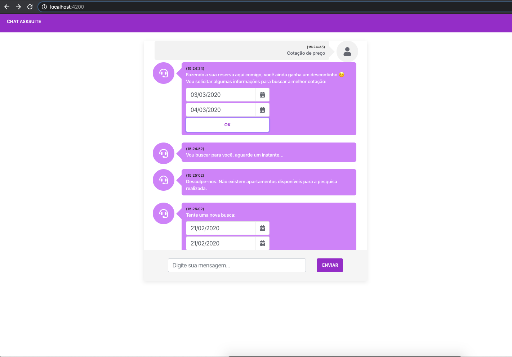

# Desafio Asksuite

Esse projeto foi gerado com [Node](https://nodejs.org) version 10.15.3 and [Angular CLI](https://github.com/angular/angular-cli) version 8.3.19.

## Backend server

Execute `node start` ou `yarn start` para um servidor dev backend. Navegue para `http://localhost:3333/`. acessar a API.

## Frontend server

Execute `ng serve` para um dev server. Navegue `http://localhost:4200/`. O aplicativo será recarregado automaticamente se você alterar qualquer um dos arquivos de origem.

## Build

#### (Opcional)

Execute `ng build` para gerar o build do seu projeto. Os artefatos de construção serão armazenados na pasta `dist/`. Use a flag `--prod` para um build de produção.

## Images do projeto

## help

Para obter mais ajuda sobre a CLI Angular, use `ng help` ou verifique em [Angular CLI README](https://github.com/angular/angular-cli/blob/master/README.md).
